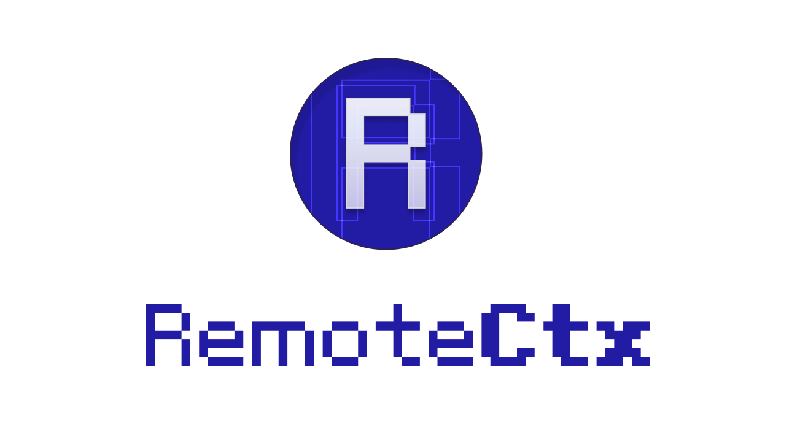

<p align="center">
  
</p>


# RemoteCtx

一个可以远程调试另一 JavaScript 上下文的工具。

只要目标环境支持 `WebSocket`，就可以把目标上下文的对象暴露到另一个上下文，例如把浏览器中的网页的上下文暴露到 NodeJs 中，这样你可以在 NodeJS 中像访问本地对象一样访问远程上下文。

也可以在工作上下文调用目标上下文的函数。

## 示例

**Figma 插件的 JavaScript 环境**

```ts
import { RemoteCtxHost } from "remote-ctx"

const remoteCtxHost = new RemoteCtxHost({
    // 本地 RemoteCtx 的服务地址
    url: "http://localhost:16633",
})
```

**NodeJs 环境**

```ts
import { RemoteCtx } from "remote-ctx"

const figmaCtx = new RemoteCtx({ port: 16633 })
await figmaCtx.ready // 等待 Figma 上下文准备好

let host = figmaCtx.host

// 读取属性 (同步)
host.window.innerHeight // 读取 Figma 网页上下文的 window.innerHeight

// 设置属性 (同步)
host.window.document.title = "Debug 2"

// 调用函数 (同步)
host.alert("Hello World")

// 调用函数 (异步)
await host.window.fetch("https://jsonplaceholder.typicode.com/todos/1")

// 远程执行
host.eval("console.log('Hello World')")
```

## 浏览器扩展

在 `extension` 目录下是一个浏览器，扩展可以帮助把 `RemoteCtxHost` 注入到目标网页中。

## 实现原理

### 概念

- `Host`：主机上下文，指被调试的 JavaScript 环境，例如 Figma 插件、Photoshop UXP、浏览器的 JavaScript 环境， 只要支持 `WebSocket` 协议，就可以作为 HOST 环境。

- `Work`：工作上下文，指进行调试工作的 JavaScript 环境，例如 NodeJs ，只要支持创建 `WebSocket` 服务。

### `RemoteCtxHost`

在 Host 端中，运行 `RemoteCtxHost`，他会通过指定的 `url` 来尝试用 `WebSocket` 连接一个 `RemoteCtx` 创建的服务。

连接成功后就可以等待 Work 端 `RemoteCtx` 的命令了

### `RemoteCtx`

在 Work 端中，运行 `RemoteCtx`， 他会在指定 `port` 上创建一个 `WebSocket` 服务。

通过 `remoteCtx.host` 这个 Proxy 对象，可以访问 Host 端的上下文

### 同步调用

由于 WebSocket 是异步的，访问远程属性和调用远程的函数，都会变成异步，这并不方便，所以我们使用 `synckit` 来把需要同步的调用变成同步的。

- `remoteCtx.host` 经过处理的访问接口，同步和异步与 Host 端的访问接口保持一致。

- `remoteCtx.hostAsync` 未经过处理的访问接口，全部都是异步的了，由于未经处理，性能会更好。

### Getter 和 enumerable 属性的处理

在 Work 中，我们尽可能的还原对象属性的描述符，包括 `enumerable` 和 `get`、`set`，而 `get`、`set` 则不会在 Host 端立即取值，而是包装成占位符，等待在 Work 端实际访问时再取值。

### Class 原型链的处理

会尽可能的把 Class 的原型链还原到远端。
